# FortiGate Hairpin NAT (NAT Reflection) Lab

A hands-on lab solving a classic real-world firewall problem: internal users couldn't reach an internally-hosted web server using its **public VIP address**, even though external users could. Fixed with **Hairpin NAT (NAT loopback/reflection)** on a FortiGate.

---

## 📌 Project Objective

Host an IIS web server on the internal LAN, publish it to the internet through a FortiGate **Virtual IP (VIP)**, confirm external access works — then prove and fix the common issue where **internal clients on the same LAN cannot reach the server using its public/external IP**, by configuring hairpin NAT policies.

---

## 🖧 Environment Overview

| Component | Details |
|---|---|
| Firewall | FortiGate 300D (FW2-HA) |
| WAN interface | `port1` — `172.18.2.2/28` |
| LAN interface | Software Switch `LAN_INTERFACE` (port3 + port4) — `192.168.18.1/24` |
| Web server | Windows Server running IIS, LAN IP `192.168.18.100` |
| Published VIP | `172.18.2.11` (external) → `192.168.18.100:80` (internal), port forwarding TCP 80→80 |
| Internal test client | PC2 on LAN, `192.168.18.0/24` |
| External test client | "EX PC" simulating an internet-side user |

---

## ⚙️ Step 1 — Build and Test the Web Server Locally

Installed IIS on Windows Server and confirmed the default site loads locally before touching any firewall config.

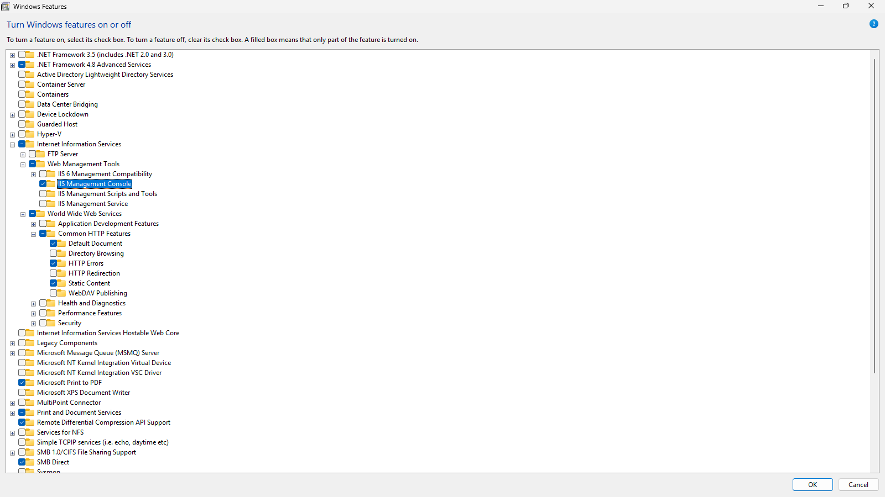

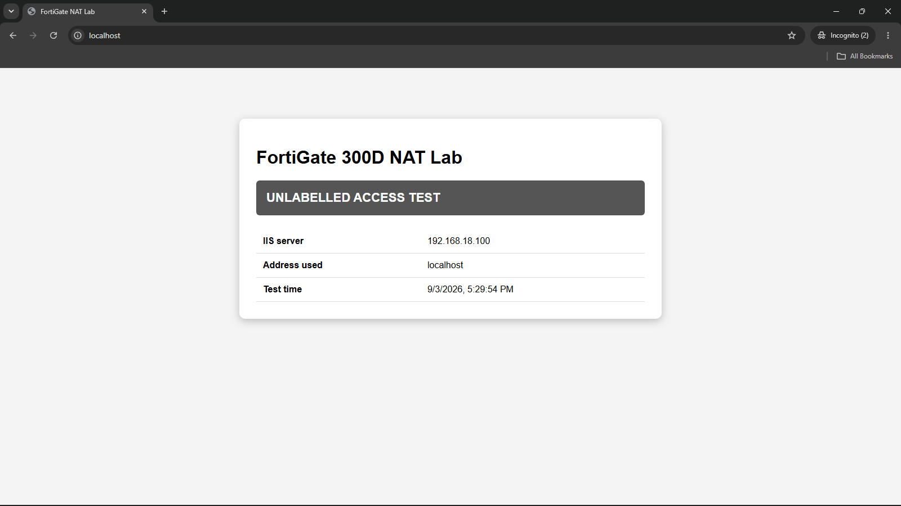

---

## ⚙️ Step 2 — FortiGate Interface & LAN Switch Setup

Reviewed the interface table — WAN on `port1`, and a LAN software switch (`port3` + `port4`) grouping the internal segment under one interface, `192.168.18.1/24`.

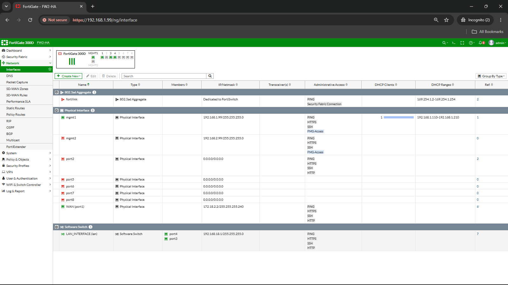
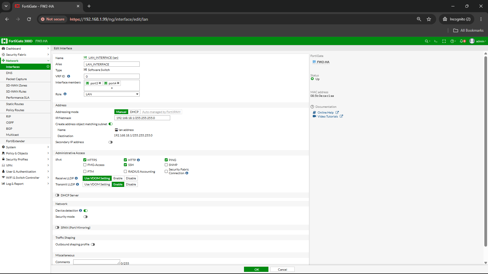

---

## ⚙️ Step 3 — Address Objects

Created address objects for each side of the connection: the public VIP address, the external test PC, and the internal LAN subnet.

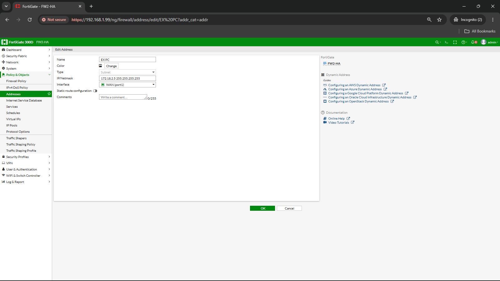
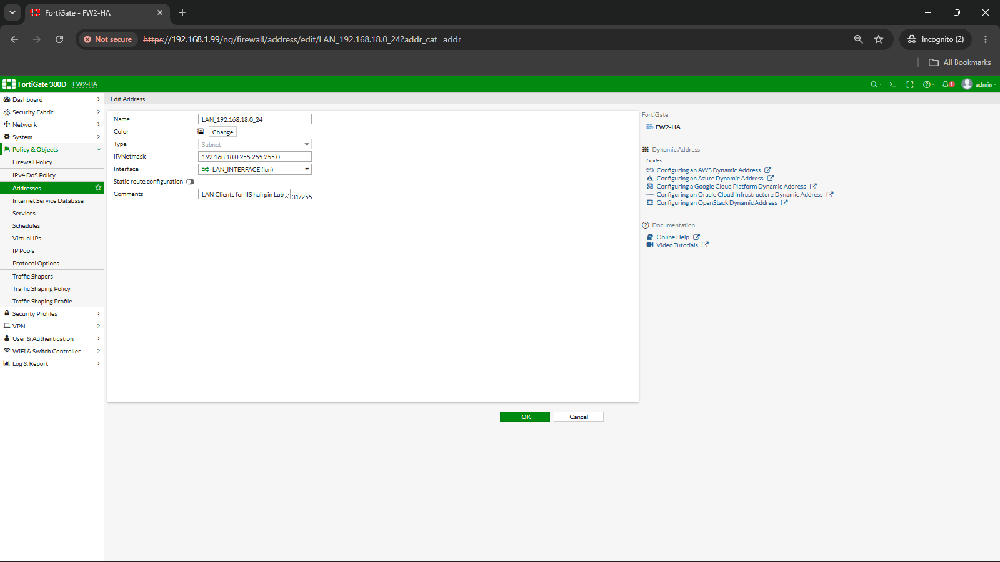

---

## ⚙️ Step 4 — Publish the Server with a Virtual IP (VIP)

Created a Static NAT VIP mapping the public IP to the internal IIS server, with port forwarding on TCP port 80.

| Setting | Value |
|---|---|
| VIP Name | `VIP_IIS_HTTP` |
| External IP | `172.18.2.11` |
| Mapped IP | `192.168.18.100` |
| Port Forwarding | TCP, external port `80` → mapped port `80` |

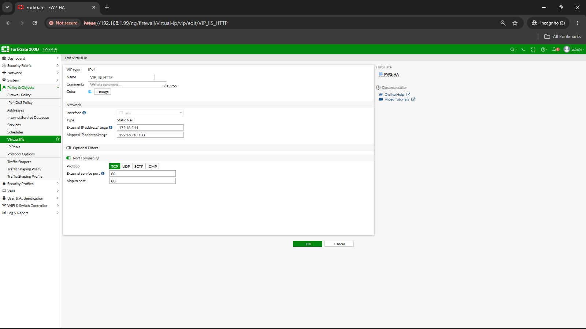

---

## ⚙️ Step 5 — WAN → LAN Policy (External Access)

Created a firewall policy allowing traffic from the internet (WAN) to the internal server via the VIP.

| Field | Value |
|---|---|
| Name | `WAN to LAN` |
| Incoming | WAN (port1) |
| Outgoing | LAN_INTERFACE (lan) |
| Source | `EX_PC` |
| Destination | `VIP_IIS_HTTP` |
| Service | HTTP |
| NAT | Disabled (VIP handles translation) |

### External access test — success
Confirmed the "EX PC" (external client) could reach the web server through the public VIP address.

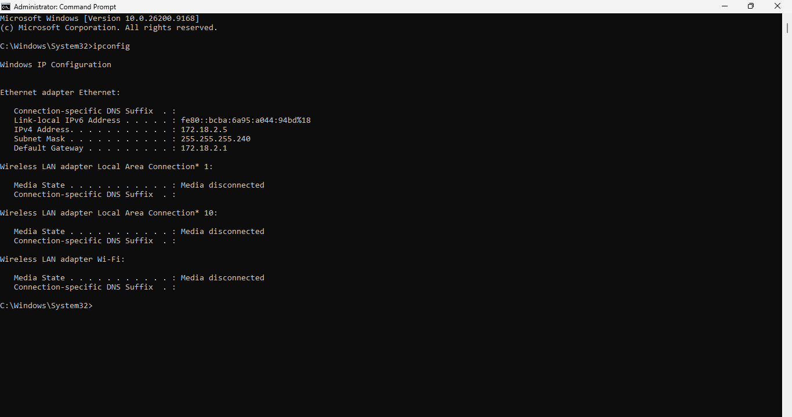
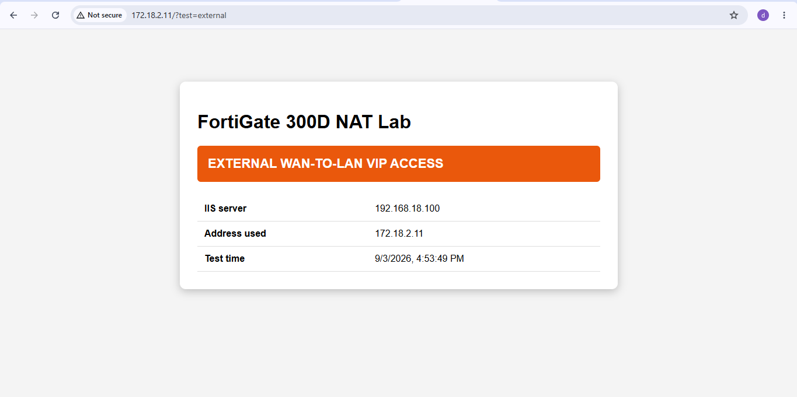

---

## ⚙️ Step 6 — Confirm Direct LAN Access Works

Before testing the hairpin scenario, confirmed that a second internal PC (PC2) on the same LAN could reach the IIS server directly using its private IP — this is the normal, expected path.

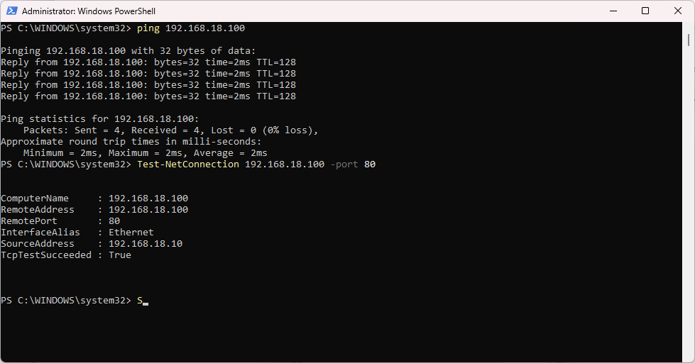
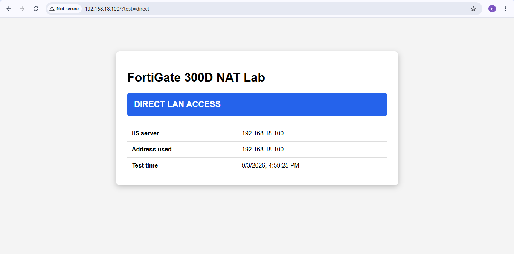

---

## ❌ Step 7 — The Problem: Internal Access to the Public VIP Fails

With only the WAN→LAN policy in place, an internal client (on the same LAN as the server) tries to reach the server using its **public VIP address** (`172.18.2.11`) instead of its private IP — and the connection **times out**.

This is the classic **hairpin NAT / NAT reflection problem**: the FortiGate has no policy allowing LAN→LAN traffic that's destined for a VIP, so the request from an internal host trying to use the external address never gets routed back to the internal server.

---

## ✅ Step 8 — The Fix: Hairpin NAT Policies

Two policies were required to make hairpin NAT work — traffic has to leave the LAN interface and come back in through the *same* LAN interface, which FortiGate only allows once it's explicitly configured.

### Policy 1 — LAN to VIP (Outside), source NAT enabled
Allows internal clients to initiate a session toward the *external* VIP address object, exiting logically through the WAN, with NAT enabled so return traffic routes correctly.

| Field | Value |
|---|---|
| Name | `HPN-1-LAN-to-VIP-Outside` |
| Incoming | LAN_INTERFACE (lan) |
| Outgoing | WAN (port1) |
| Source | `LAN_192.168.18.0_24` |
| Destination | `ADDR_WAN_VIP_HTTP` |
| Service | HTTP |
| NAT | Enabled (Use Outgoing Interface Address) |

### Policy 2 — LAN to LAN (the actual hairpin), NAT disabled
This is the key policy: incoming **and** outgoing interface are both `LAN_INTERFACE` — traffic hairpins back out the same interface it came in on, destined for the internal VIP, with NAT disabled since the VIP already handles translation.

| Field | Value |
|---|---|
| Name | `HPN-2-LAN-to-IIS-VIP` |
| Incoming | LAN_INTERFACE (lan) |
| Outgoing | LAN_INTERFACE (lan) |
| Source | `LAN_192.168.18.0_24` |
| Destination | `VIP_IIS_HTTP` |
| Service | HTTP |
| NAT | Disabled |

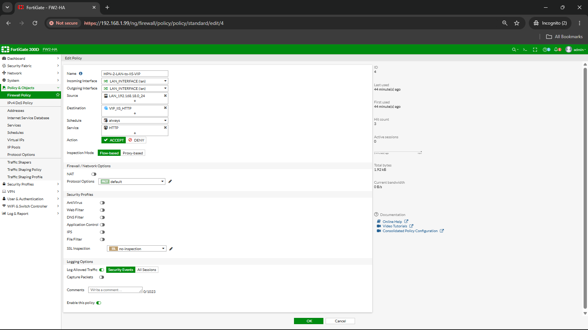

### Final policy table with hit counters
Confirmed all three policies (WAN→LAN, LAN→WAN, and the LAN→LAN hairpin) active and passing traffic, with hit counts proving each path was actually exercised during testing.

---

## ✅ Step 9 — Verification: Internal Access to the VIP Now Works

Re-tested the exact same scenario from Step 7 — an internal client hitting the public VIP address — and this time the request succeeds, confirming the hairpin NAT policies resolved the issue.

---

## ✅ Results

- Published an internal IIS web server to the internet using a FortiGate **Static NAT VIP** with port forwarding.
- Verified external clients could reach the server via its public IP.
- Reproduced the classic **hairpin NAT / NAT reflection** failure: internal clients on the same LAN couldn't reach the server using its public VIP address.
- Fixed it with two policies — a LAN→WAN policy (NAT enabled) and the critical **LAN→LAN hairpin policy** (NAT disabled) — allowing traffic to loop back out and in through the same interface.
- Confirmed the fix end-to-end: internal clients can now reach the server using either its private IP **or** its public VIP address.

---

## 🛠️ Skills Demonstrated

`FortiGate` `FortiOS` `Virtual IP (VIP) / Static NAT` `Hairpin NAT / NAT Reflection` `Firewall Policy Design` `IIS Web Server` `Software Switch Interfaces` `Network Troubleshooting` `Address Objects`

